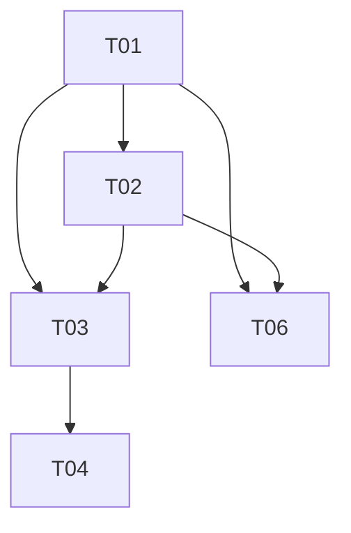

# タスク一覧

| Task | Agent | Source                                        | Test File                                          | Goal                                                           | 依存     |
| ---- | ----- | --------------------------------------------- | -------------------------------------------------- | -------------------------------------------------------------- | -------- |
| T01  | A01   | `src/app/view-model/app-store.ts`             | `src/app/view-model/app-store.test.ts`             | Zustand AppStore の state schema / action interface 骨格を導入 | なし     |
| T02  | A02   | `src/app/usecases`                            | `src/app/usecases/usecases.test.ts`                | meeting/recording/logout/report の usecase 関数を追加          | T01      |
| T03  | A03   | `src/app/container/AppShell.tsx`              | `src/App.tsx`                                      | App 実装を AppShell に移し App.tsx をルート配線のみへ縮小      | T01, T02 |
| T04  | A04   | `src/components/navigation/MeetingHeader.tsx` | `src/components/navigation/MeetingHeader.test.tsx` | MeetingHeader から confirm 判定を削除し onBackRequested へ変更 | T03      |
| T05  | A05   | `src/hooks/useAttachMediaStream.ts`           | `src/hooks/useMediaStreamController.test.ts`       | videoRef attach を専用 hook に分離                             | なし     |
| T06  | A06   | `src/hooks/useMeetingSession.ts`              | `src/hooks/useMeetingSession.test.ts`              | useMeetingSession を非推奨化し内部委譲可能な形へ整理           | T01, T02 |

## 依存関係

